# Mermaid Diagram Generator

Create clear, maintainable diagrams using Mermaid syntax in markdown.

## Core Workflow

1. **Identify diagram type**: Flow, sequence, ERD, etc.
2. **Define elements**: Nodes, connections, labels
3. **Apply styling**: Colors, shapes, directions
4. **Add interactions**: Click handlers (optional)
5. **Embed in docs**: Markdown integration

## Flowchart Diagrams

### Basic Flowchart

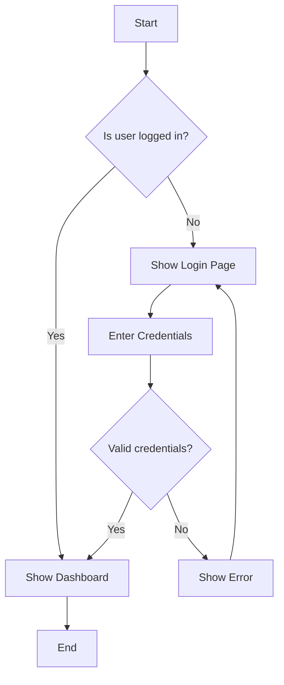

### Node Shapes

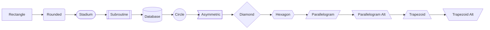

### Subgraphs

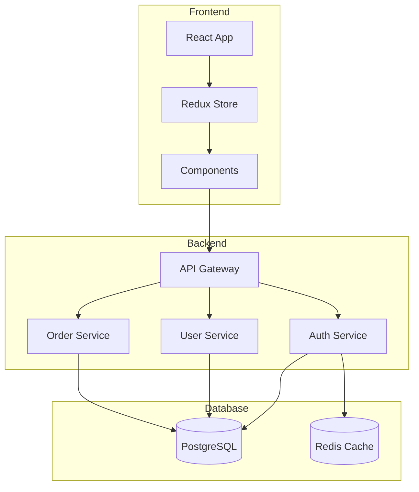

### Styled Flowchart

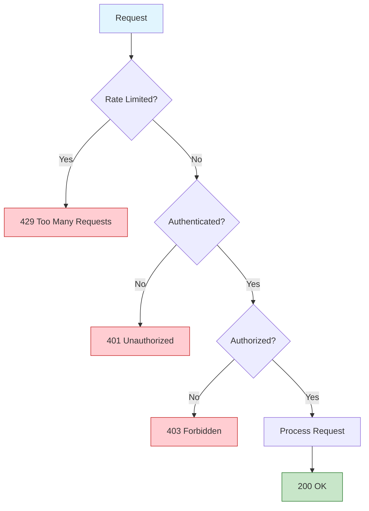

## Sequence Diagrams

### API Request Flow

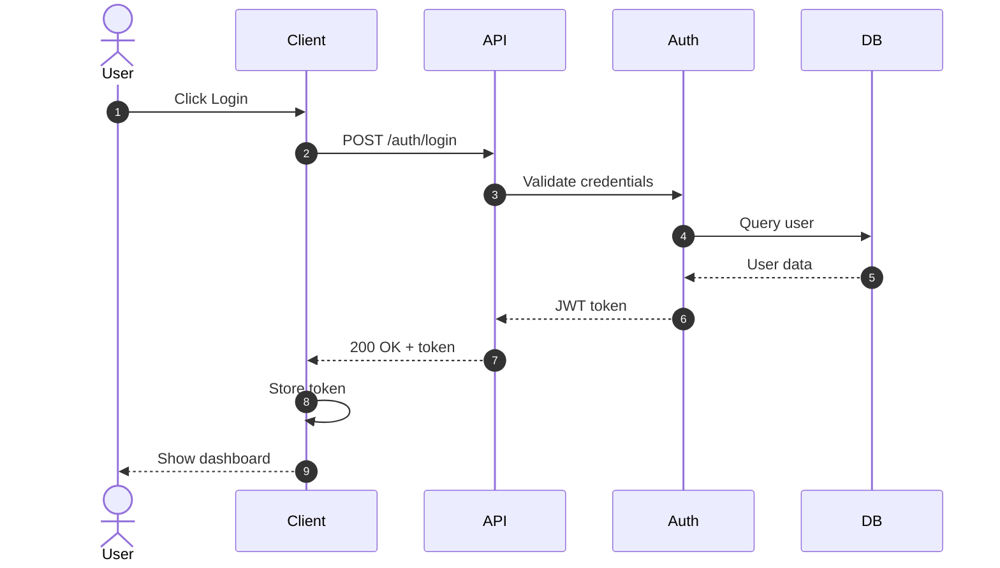

### With Loops and Conditions

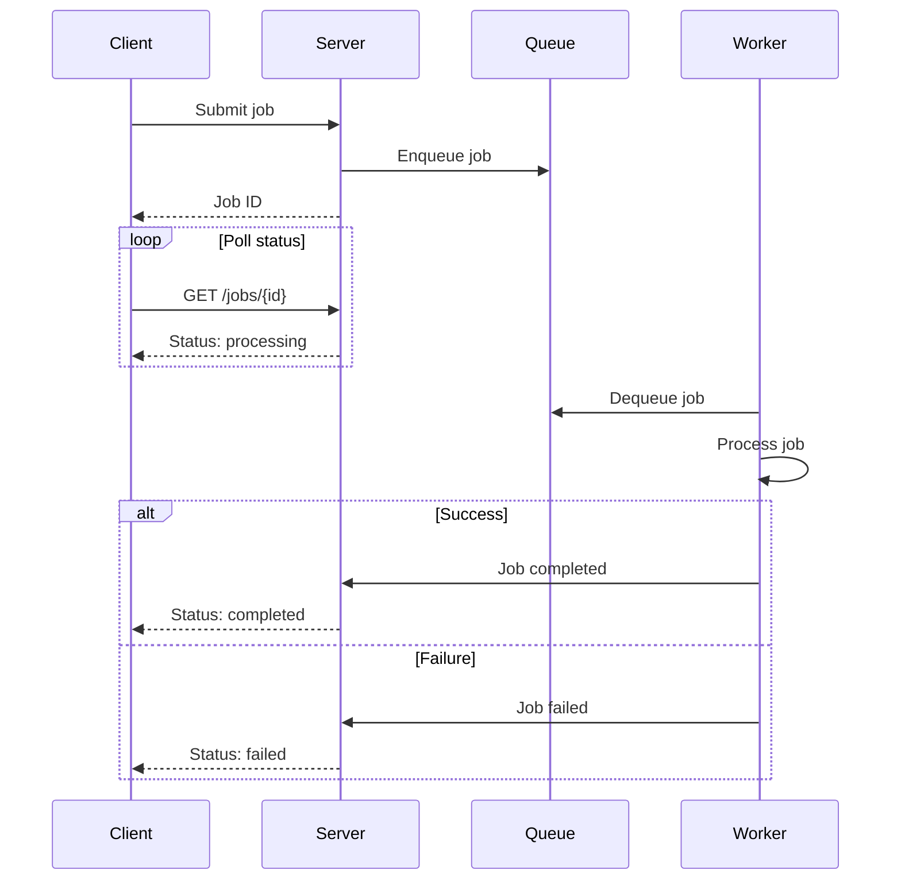

### With Notes and Activations

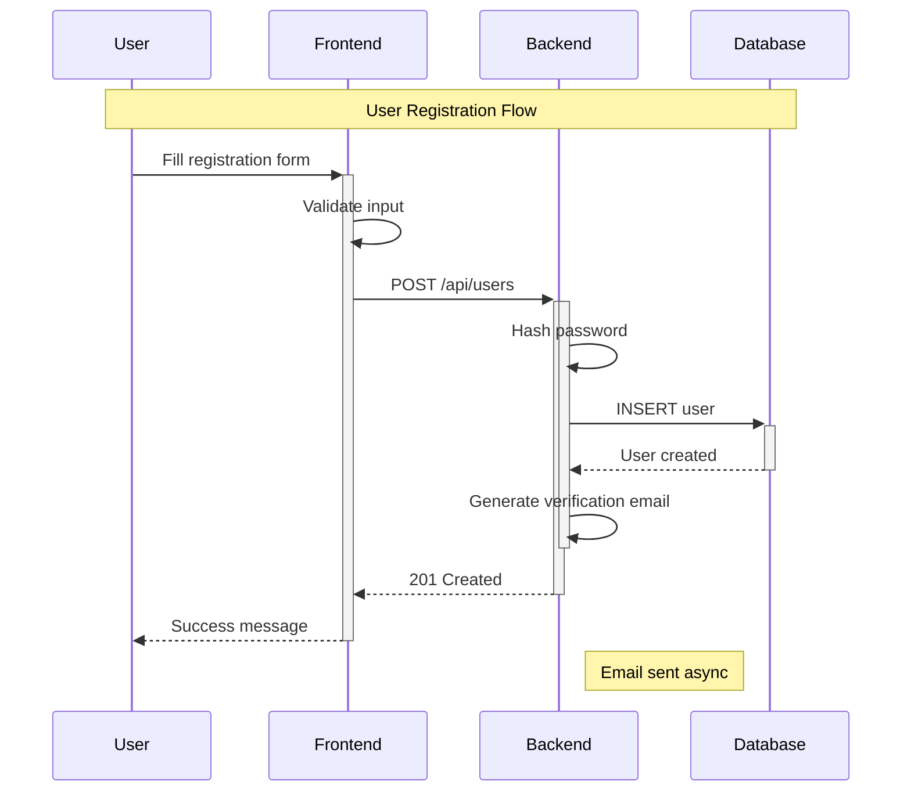

## Entity Relationship Diagrams

### Database Schema

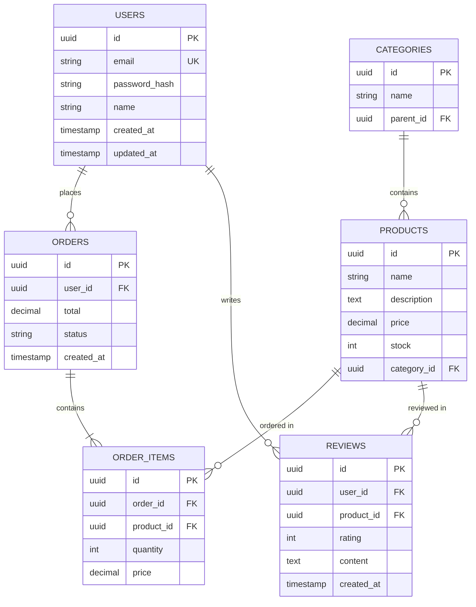

## State Diagrams

### Order State Machine

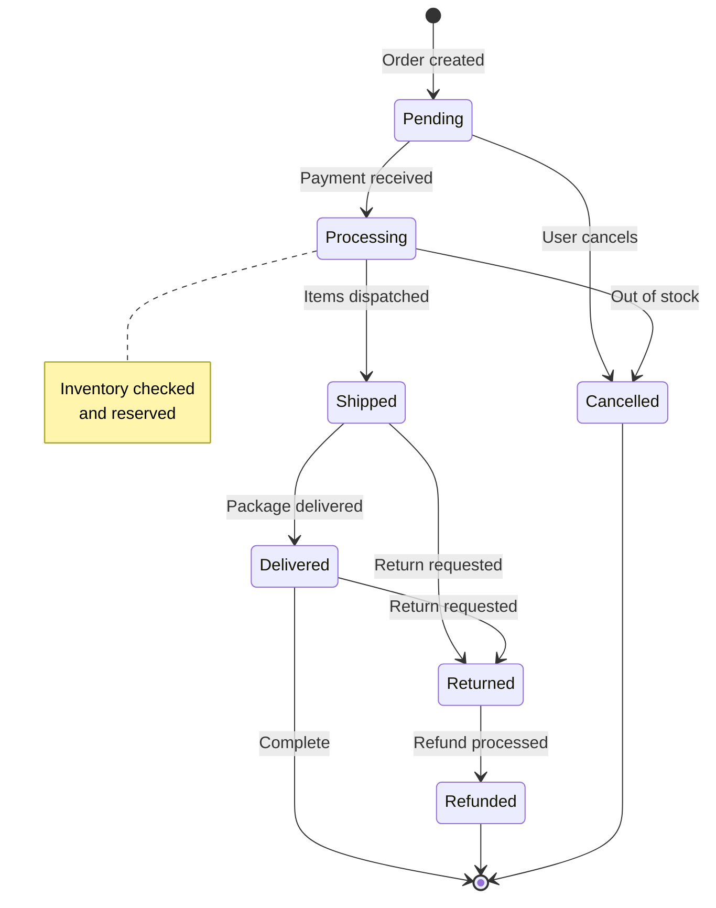

### With Composite States

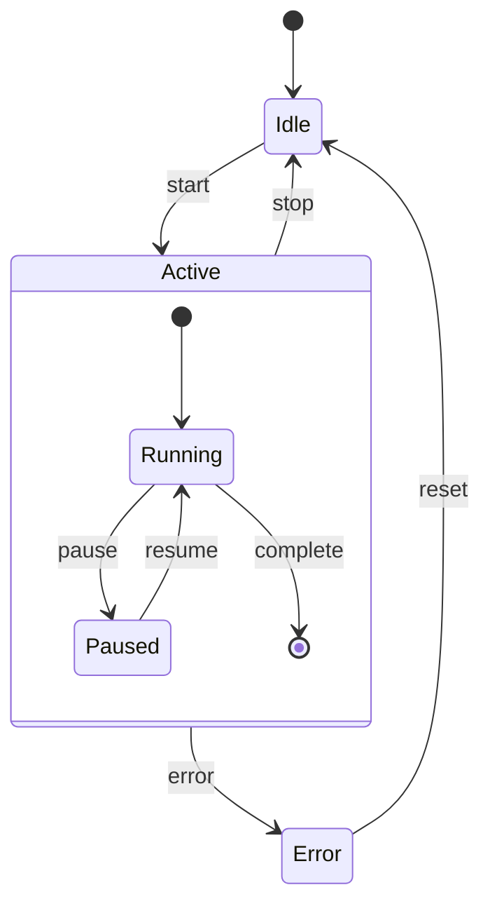

## Class Diagrams

### TypeScript Classes

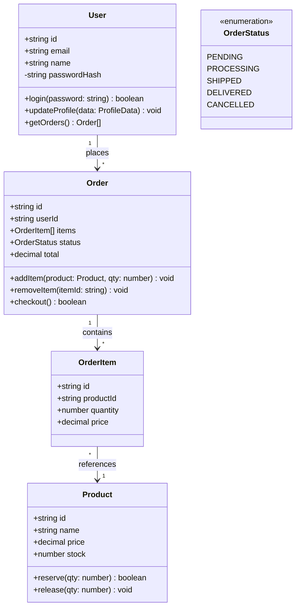

## Architecture Diagrams

### C4 Context Diagram

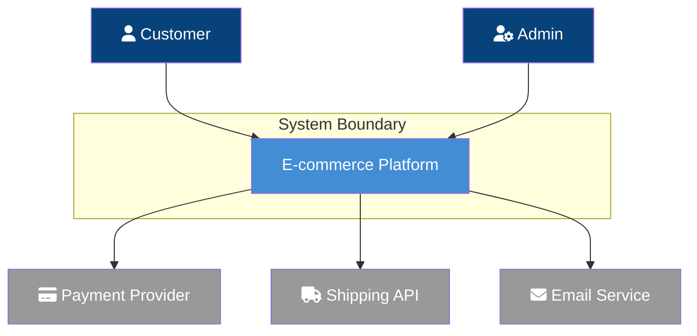

### Microservices Architecture

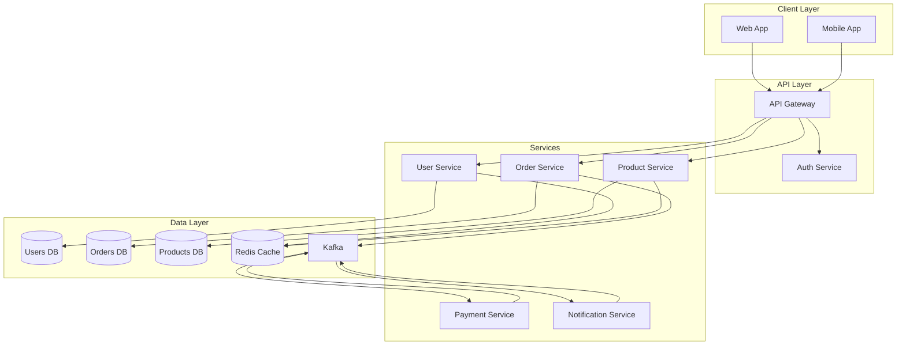

## Git Graph

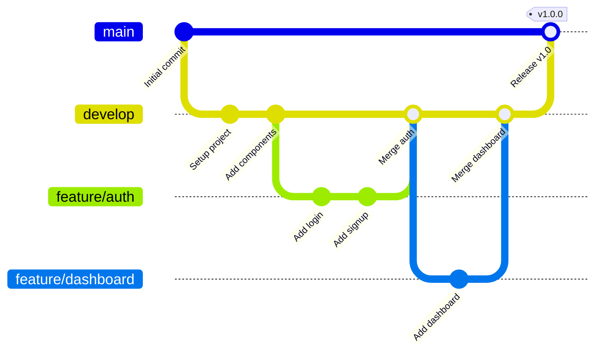

## Pie Charts

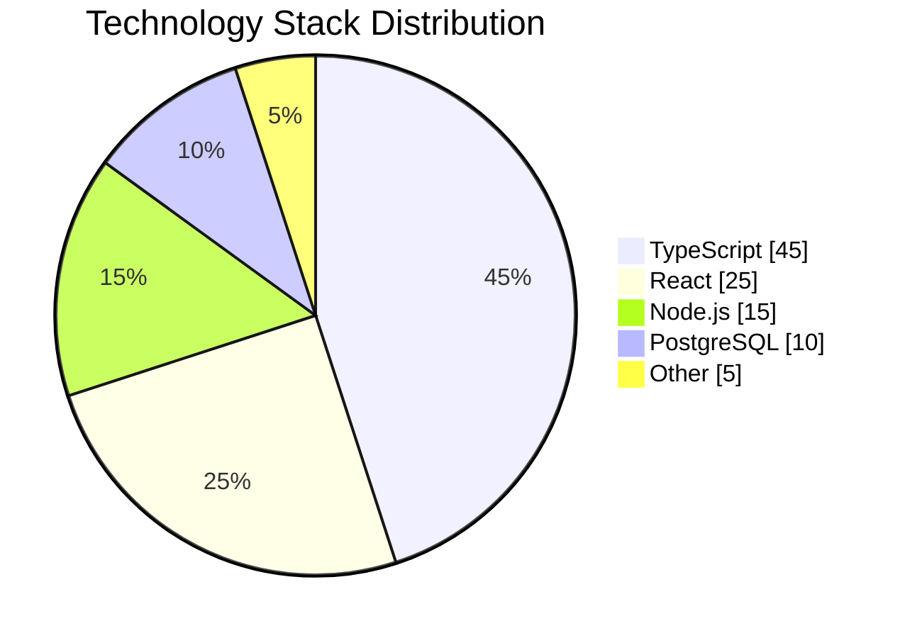

## Timeline

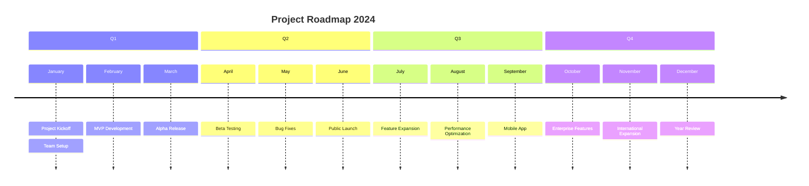

## Mindmap

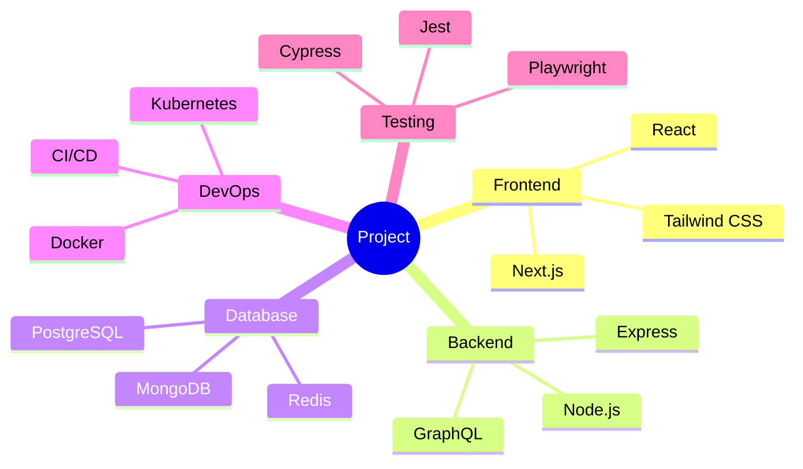

## Best Practices

1. **Keep it simple**: Avoid overcrowded diagrams
2. **Use subgraphs**: Group related elements
3. **Consistent styling**: Define class styles
4. **Direction matters**: LR for processes, TD for hierarchies
5. **Add notes**: Clarify complex parts
6. **Use icons**: Font Awesome integration
7. **Version control**: Diagrams are code
8. **Document purpose**: Add titles and descriptions

## Output Checklist

Every Mermaid diagram should include:

- [ ] Appropriate diagram type
- [ ] Clear node labels
- [ ] Logical flow direction
- [ ] Subgraphs for grouping
- [ ] Consistent styling
- [ ] Meaningful connections
- [ ] Notes where needed
- [ ] Title or description
- [ ] Proper syntax validation
- [ ] Readable at expected size
