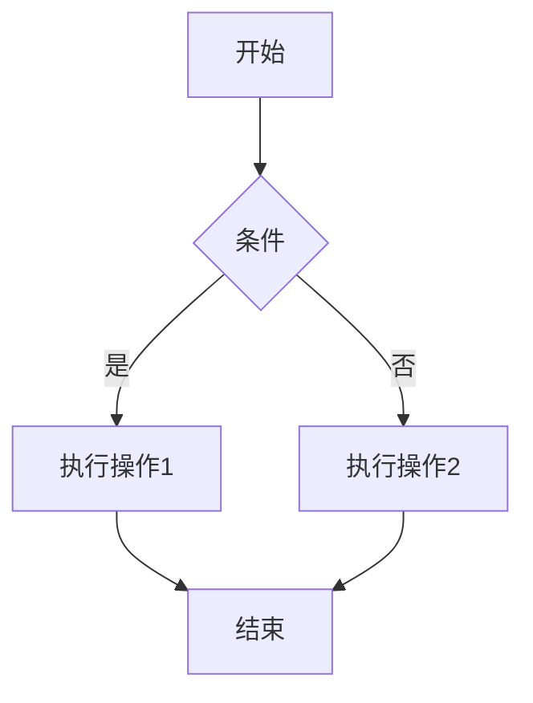

+++
title = "Markdown 语法速查表"
date = 2026-02-05T17:31:33+08:00
draft = false
tags = ["Markdown", "教程", "写作"]
categories = ["技术"]
toc = true  # 启用目录
+++

## 标题

```markdown
# H1
## H2
### H3
#### H4
##### H5
###### H6
```

## 文本样式

```markdown
*斜体* 或 _斜体_
**粗体** 或 __粗体__
***粗斜体*** 或 ___粗斜体___
~~删除线~~
`行内代码`
```

## 列表

### 无序列表

```markdown
- 项目 1
  - 子项目 1
  - 子项目 2
- 项目 2
- 项目 3
```

### 有序列表

```markdown
1. 第一项
2. 第二项
   1. 子项 1
   2. 子项 2
3. 第三项
```

## 链接和图片

```markdown
[链接文字](https://example.com)


[参考式链接][id]

[id]: https://example.com "可选标题"
```

## 引用

```markdown
> 这是一个引用。
> 可以有多行。
> 
> > 嵌套引用
```

## 代码块

````markdown
```python
def hello():
    print("Hello, World!")
```

```javascript
console.log('Hello, World!');
```

```bash
# 这是一条注释
ls -la
```
````

## 表格

```markdown
| 左对齐 | 居中对齐 | 右对齐 |
|:-------|:--------:|-------:|
| 左     |    中    |     右 |
| 数据   |   数据   |   数据 |
```

## 任务列表

```markdown
- [x] 已完成任务
- [ ] 待办事项 1
- [ ] 待办事项 2
```

## 脚注

```markdown
这是一个脚注示例[^1]。

[^1]: 这是脚注的内容。
```

## 内嵌 HTML

```html
<details>
  <summary>点击展开</summary>
  这里是被隐藏的内容。
</details>
```

## 数学公式

```markdown
行内公式：$E = mc^2$

块级公式：

$$ 
\sum_{i=1}^n i = \frac{n(n+1)}{2} 
$$
```

## 图表（使用 Mermaid）

````markdown

````

## 提示框

```markdown
> **提示**：这是一个信息提示框。

> **警告**：这是一个警告提示框。

> **危险**：这是一个危险提示框。
```

或者使用 HTML 和 CSS 实现更丰富的样式：

```html
<div style="background-color: #e7f5ff; border-left: 4px solid #4dabf7; padding: 8px 16px; margin: 16px 0; border-radius: 4px;">
  <strong>提示</strong>：这是一个信息提示框。
</div>

<div style="background-color: #fff3bf; border-left: 4px solid #ffd43b; padding: 8px 16px; margin: 16px 0; border-radius: 4px;">
  <strong>警告</strong>：这是一个警告提示框。
</div>

<div style="background-color: #ffd8a8; border-left: 4px solid #ffa94d; padding: 8px 16px; margin: 16px 0; border-radius: 4px;">
  <strong>危险</strong>：这是一个危险提示框。
</div>

## 视频
这里视频不能正常打开播放，因为这里不做导流，谢谢。 

```markdown

```


## 自定义样式

```markdown
<span style="color:red">红色文字</span>

<div style="background-color: #f5f5f5; padding: 10px; border-left: 4px solid #3498db;">
  这是一个自定义样式的区块。
</div>
```

## 表情符号

```markdown
:smile: :heart: :rocket: :tada:
```

## 分割线

```markdown
---
或者
***
或者
___
```

## 转义字符

```markdown
\*这段文字会被星号包围\*
```

## 目录

PaperMod 主题会自动为文章生成目录。要启用目录，请在文章的前言部分添加：

```yaml
---
toc: true  # 启用目录
tocOpen: true  # 默认展开目录
---
```

目录会自动显示在文章的右上角（桌面端）或文章顶部（移动端）。

## 最后

这只是一个基础的 Markdown 语法速查表。不同的 Markdown 解析器可能支持不同的扩展语法。

要查看效果，只需在 Hugo 中保存此文件，然后刷新浏览器即可。

Happy Writing! :memo:
